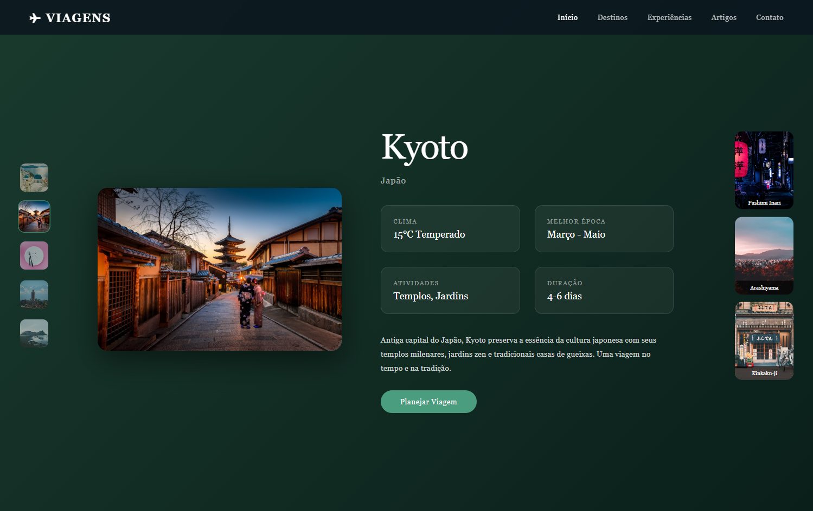

# Destinos de Viagem - Portfolio Interativo

<div align="center">


**Portfolio elegante e interativo de destinos turísticos 🌍✈️**

Explore os destinos mais incríveis do mundo com uma interface moderna e imersiva

</div>

---

## Sobre o Projeto

**Destinos de Viagem** é um portfolio interativo que apresenta destinos turísticos ao redor do mundo de forma elegante e envolvente. O projeto conta com navegação intuitiva, animações suaves e um design moderno inspirado em portfolios de artistas renomados.

### Características Principais

- Design elegante com gradientes e efeitos visuais modernos
- Navegação lateral com thumbnails clicáveis
- Galeria de destaques para cada destino
- Grid de informações organizadas (clima, melhor época, atividades, duração)
- Animações e transições suaves entre destinos
- Navegação por teclado (setas para cima/baixo)
- Interface totalmente responsiva
- Arquitetura modular com separação clara de responsabilidades

---

## Tecnologias Utilizadas

- **HTML5** - Estrutura semântica da página
- **CSS3** - Estilização moderna com gradientes, animações e grid
- **JavaScript (ES6+)** - Lógica de navegação e manipulação do DOM
- **Unsplash API** - Imagens de alta qualidade dos destinos

---

## Preview

<div align="center">



</div>

---

## Como Rodar o Projeto

### Pré-requisitos

- Navegador web moderno (Chrome, Firefox, Safari, Edge)
- Servidor local (opcional, mas recomendado)

### Instalação

1. **Clone o repositório**

```bash
git clone https://github.com/erikalaiane/destinos-viagem.git
```

2. **Entre no diretório do projeto**

```bash
cd destinos-viagem
```

3. **Abra no navegador**

Opção 1 - Abra diretamente o arquivo `index.html` no navegador

Opção 2 - Use um servidor local (recomendado):

```bash
# Com Python
python -m http.server 8000

# Com Node.js (http-server)
npx http-server

# Com VS Code
# Use a extensão "Live Server"
```

4. **Acesse no navegador**

Acesse [http://localhost:8000](http://localhost:8000) (ou a porta configurada)

---

## Estrutura do Projeto

```
destinos-viagem/
├── images/
│   └── site.png         # Preview do projeto
├── index.html           # Estrutura HTML
├── style.css            # Estilos e animações
├── script.js            # Lógica e funcionalidades
└── README.md            # Documentação
```

---

## Funcionalidades

### Navegação

- **Sidebar**: Clique nos thumbnails para navegar entre destinos
- **Teclado**: Use as setas ↑↓ para alternar entre destinos
- **Galeria**: Visualize os destaques de cada local

### Destinos Disponíveis

1. **Santorini** 🇬🇷 - Grécia
2. **Kyoto** 🇯🇵 - Japão
3. **Patagônia** 🏔️ - Argentina & Chile
4. **Marrakech** 🇲🇦 - Marrocos
5. **Islândia** 🌋 - Norte da Europa

### Informações de Cada Destino

- Clima típico
- Melhor época para visitar
- Principais atividades
- Duração recomendada da viagem
- Descrição detalhada
- Galeria de pontos turísticos

---

## Responsividade

O projeto é totalmente responsivo e testado em:

- Mobile (320px - 767px)
- Tablet (768px - 1023px)
- Desktop (1024px+)
- Large Desktop (1440px+)

---

## Personalizando os Destinos

Para adicionar novos destinos, edite o array `destinations` no arquivo `script.js`:

```javascript
{
    name: 'Nome do Destino',
    country: 'País',
    image: 'URL da imagem principal',
    thumb: 'URL do thumbnail',
    climate: 'Temperatura e tipo de clima',
    bestTime: 'Melhor época',
    activities: 'Principais atividades',
    duration: 'Duração recomendada',
    description: 'Descrição do destino',
    highlights: [
        { img: 'URL', label: 'Local 1' },
        { img: 'URL', label: 'Local 2' },
        { img: 'URL', label: 'Local 3' }
    ]
}
```

---

## Contribuindo

Contribuições são sempre bem-vindas! Para contribuir:

1. Faça um fork do projeto
2. Crie uma branch para sua feature (`git checkout -b feature/MinhaFeature`)
3. Commit suas mudanças (`git commit -m 'Adiciona nova feature'`)
4. Push para a branch (`git push origin feature/MinhaFeature`)
5. Abra um Pull Request

---

## Inspiração

Este projeto foi inspirado em portfolios modernos de artistas e designers, trazendo uma experiência visual rica e imersiva para apresentar destinos de viagem de forma única.

---

## Autora

**Erika Laiane**

[](https://github.com/erikalaiane)
[](https://www.linkedin.com/in/erika-laiane-azevedo)
[](mailto:erikalaianeazevedosantos@gmail.com)

---

<div align="center">

Desenvolvido com 💜 por Erika Laiane

</div>